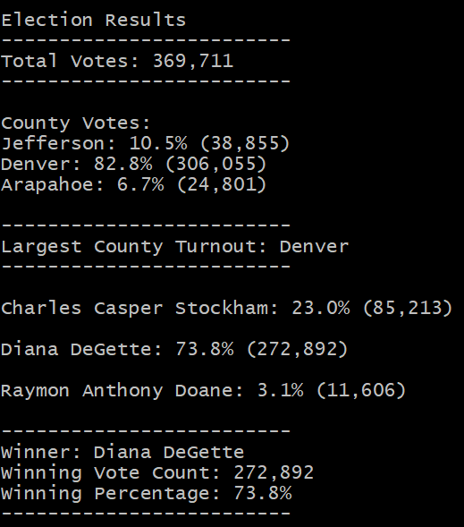

# Election Analysis

## Overview
For our election analysis we would like to use the data provided in the election_results.csv file to determine the total number of votes cast in each county and for which candidates. Additionally, we will use this data to determine which candidate received the greatest percentage of total votes, and therefore won the election, as well as which counties had the greatest voter turnout.

## Results
- 369,711 total votes were cast in this congressional election.
- Votes by county:
    - Jefferson: 38,855 (10.5%)
    - Denver: 306,055 (82.8%)
    - Arapahoe: 24,801 (6.7%)
- Denver had the greatest number of votes.
- Votes by candidate:
    - Charles Casper Stockham: 23.0% (85,213)
    - Diana DeGette: 73.8% (272,892)
    - Raymon Anthony Doane: 3.1% (11,606)
- Diance DeGette won the election with 73.8% of the vote totalling 272,892 votes.

## Summary
Our analysis and code could be easily used to tabulate voter data for any election. Given a different datafile the code provided could give election results so long as the data follows the same format as the file given here. Even if there were a different number of candidates or counties, the code would still operate correctly. In elections where the two candidates with the most votes win, perhaps for city council elections, the script could be easily modified to output the top two or more candidates. Additionally, given county population parameters the code could also calculate and output voter turnout per capita in each county.